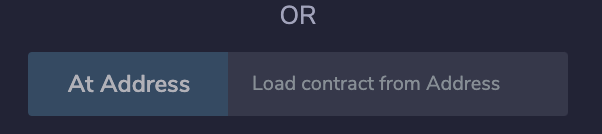

# Kubercoin

### Setting up a private ethereum network 

#### 1. Download Ethereum: https://geth.ethereum.org/downloads/
or with Mac:
```
brew tap ethereum/ethereum
brew install ethereum
```
#### 2. Create a new folder containing the genesis file (genesis.json):
```
{
    "nonce": "0x0000000000000042",
    "timestamp": "0x0",
    "parentHash": "0x0000000000000000000000000000000000000000000000000000000000000000",
    "extraData": "0x00",
    "gasLimit": "0x8000000",
    "difficulty": "0x400",
    "mixhash": "0x0000000000000000000000000000000000000000000000000000000000000000",
    "coinbase": "0x3333333333333333333333333333333333333333",
    "alloc": {},
    "config": {
        "chainId": 9870, 
        "homesteadBlock": 0, 
        "eip150Block": 0, 
        "eip155Block": 0, 
        "eip158Block": 0,
        "byzantiumBlock": 0,
        "constantinopleBlock": 0,
        "petersburgBlock": 0,
        "ethash": {}
    }
}
```
#### 3. Initialized two new blockchain nodes on two terminal windows:
```
geth --datadir blkchain1 init genesis.json
geth --datadir blkchain2 init genesis.json
```
#### 4. Start nodes using Geth:
```
geth --identity "name_of_your_node" --rpc --rpcport "8000" --rpccorsdomain "*" --datadir blkchain1 --port "30303" --nodiscover --rpcapi "db,eth,net,web3,personal,miner,admin" --networkid 1900 --allow-insecure-unlock --nat "any"
```
for the second node use 
```
geth --identity "name_of_your_node_2" --rpc --rpcport "8001" --rpccorsdomain "*" --datadir blkchain2 --port "30304" --nodiscover --rpcapi "db,eth,net,web3,personal,miner,admin" --networkid 1900 --allow-insecure-unlock --nat "any"
```
you can add console at the end or use
```
geth attach http://127.0.0.1:8000/
```
to connect to the node
#### 5. Create a new account on each console:
```
personal.newAccount()
```
#### 6. Connect the two nodes:
Run on first node:
```
admin.nodeInfo
```
Then run on second node:
```
admin.addPeer(“//enode id”)
```
#### 7. Start mining:
```
miner.start()
```
to stop mining:
```
miner.stop()
```


### Deploying the Contract
#### 1. Open Remix browser: https://remix.ethereum.org/
#### 2. Create new file in contracts list and copy paste KuberCoin code: https://remix.ethereum.org/

#### 3. Compile the code


#### 4. Connect to a node using Web3 Provider and port number, then deploy:


#### 5. Deploy all the contracts:


#### 6. Now you can run functions:


#### 7. Connect other nodes via at Address and copy the address of the contract you wish to connect to:


